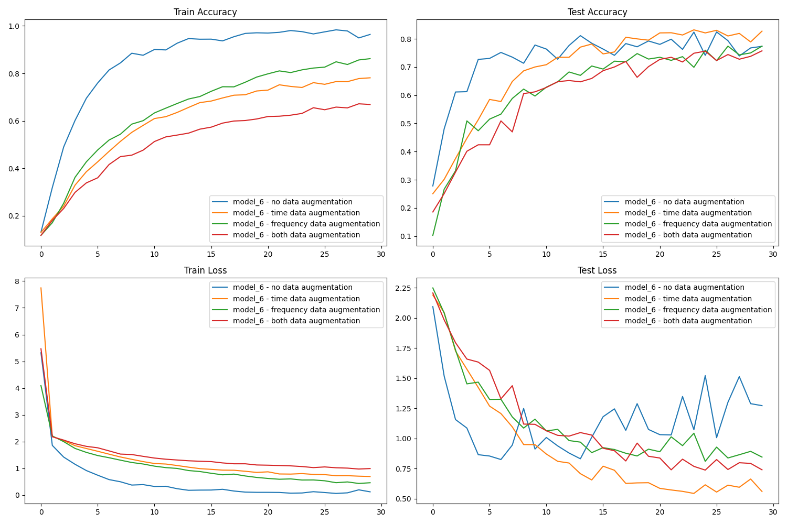

# Audio Classification using CNNs on UrbanSound8K

This project aims to classify urban sounds using various Convolutional Neural Network (CNN) architectures. The dataset used for this project is the [UrbanSound8K dataset](https://urbansounddataset.weebly.com/urbansound8k.html).

## Objectives

* Understand **audio signal processing for deep learning**, specifically using mel spectrograms.
* Implement and experiment with different **CNN architectures for audio classification**.
* Learn and apply **Git and programming best practices**.
* Investigate the impact of various **hyperparameters on the model's performance**.
* Explore different **audio augmentation techniques** and their effects on model accuracy.

## Dataset
The UrbanSound8K dataset is utilized in this project. It contains 8732 labeled sound excerpts of urban sounds from 10 classes:

* Air Conditioner
* Car Horn
* Children Playing
* Dog bark
* Drilling
* Engine Idling
* Gun Shot
* Jackhammer
* Siren
* Street Music

Each audio file in this dataset is less than 4 seconds.

## Methodology

### Audio Signal Processing

**Mel spectrograms** are employed to convert audio signals into visual representations, which are then fed into the CNN model for training.

### Audio Normalization

To maintain consistency across the dataset and improve the model's training efficiency all audio files are converted to **mono** to ensure a single channel. Each audio clip is treated to have the **same duration**. This ensures that the input to the model is of a consistent shape.

### Model Architecture

Various **Convolutional Neural Network (CNN) architectures** are experimented with for classifying the audio signals. Detailed architecture configurations and layers will be updated as the project progresses.

### Hyperparameter Tuning

The project will delve into the impact of various hyperparameters such as:

* Batch size
* Number of epochs
* Duration of audio clips
* Audio augmentation techniques


## Getting Started

### Installation

Clone the repository:

```
git clone https://github.com/zaquastier/audio_classification.git
```

Navigate to the project directory and install the required packages:

```
cd audio_classification
pip install -r requirements.txt
```

### Download and extract the dataset:

```
python download.py
```

### Run the main script to train the models(this will be updated as the project progresses):

```
python train.py --model <model_names> --batch_size <size> --number_of_epochs <epochs> --duration <durations>
```

**Parameters**

* --model: Specify the model (e.g., model_1,model_2).
* --batch_size: Set the batch size for training (e.g., 8, 64).
* --number_of_epochs: Define how many epochs the training should run (e.g., 5, 10, 15).
* --duration: Set the duration of audio samples in minutes(e.g., 0.5, 2, 3).

You can specify multiple values for each parameter by separating them with commas, allowing you to train the model multiple times with different configurations."

**Optional Flags**

* --output: Name of the output file with training results (parameters, accuracy, loss) 

You can also include optional flags for data augmentation:

* --no_aug: Run training without any data augmentation.
* --time_aug: Apply time-based data augmentation.
* --freq_aug: Apply frequency-based data augmentation.
* --both_aug: Apply both time and frequency data augmentation.
* --all: Include all augmentation options.

**Example**

```
python train.py --model model_1,model_2 --batch_size 8 --number_of_epochs 15 --duration 0.5,3 --no_aug --freq_aug
```

This will train the following:

* Model: model_1, Batch Size: 8, Number of epochs: 15, Duration of audio sample: 0.5 minutes, no data augmentation 
* Model: model_1, Batch Size: 8, Number of epochs: 15, Duration of audio sample: 0.5 minutes, frequency data augmentation 
* Model: model_1, Batch Size: 8, Number of epochs: 15, Duration of audio sample: 3 minutes, no data augmentation 
* Model: model_1, Batch Size: 8, Number of epochs: 15, Duration of audio sample: 3 minutes, frequency data augmentation 
* Model: model_2, Batch Size: 8, Number of epochs: 15, Duration of audio sample: 0.5 minutes, no data augmentation 
* Model: model_2, Batch Size: 8, Number of epochs: 15, Duration of audio sample: 0.5 minutes, frequency data augmentation 
* Model: model_2, Batch Size: 8, Number of epochs: 15, Duration of audio sample: 3 minutes, no data augmentation 
* Model: model_2, Batch Size: 8, Number of epochs: 15, Duration of audio sample: 3 minutes, frequency data augmentation 


## Model Architectures

TODO: Describe model architectures

Note: our best performing models have too many parameterers and are too heavy for github. This is not problematic since the goal of this project is to show my understanding of audio classification and reporting.

## Results and Analysis

The following table shows the top 10 models for test accuracy.

Top 10 models based on Test Accuracy:
| model_name   |   number_of_epochs |   batch_size |   duration | time_augment   | freq_augment   |   train_accuracy |   test_accuracy |   train_loss |   test_loss |
|:-------------|-------------------:|-------------:|-----------:|:---------------|:---------------|-----------------:|----------------:|-------------:|------------:|
| model_6      |                 10 |           64 |          3 | False          | False          |         0.883178 |        0.805953 |     0.364478 |    0.737663 |
| model_6      |                 10 |           64 |          1 | False          | False          |         0.831496 |        0.771608 |     0.541975 |    0.780939 |
| model_3      |                 10 |           64 |          3 | False          | False          |         0.820759 |        0.736119 |     0.545594 |    1.04135  |
| model_6      |                 10 |            8 |          1 | False          | False          |         0.826485 |        0.723526 |     0.586806 |    1.00673  |
| model_6      |                 10 |           64 |          3 | True           | False          |         0.576521 |        0.71494  |     1.24043  |    0.852548 |
| model_6      |                 10 |            8 |          3 | False          | False          |         0.871296 |        0.713795 |     0.448825 |    1.21069  |
| model_6      |                 10 |           64 |          1 | True           | False          |         0.575376 |        0.694333 |     1.27754  |    0.967814 |
| model_6      |                 10 |            8 |          3 | True           | False          |         0.63078  |        0.688609 |     1.13875  |    1.04009  |
| model_3      |                 10 |           64 |          3 | True           | True           |         0.541016 |        0.685175 |     1.30728  |    0.932843 |
| model_3      |                 10 |           64 |          1 | False          | False          |         0.78912  |        0.683457 |     0.621747 |    1.11221  |

We notice that model 6 gets better results by leveraging the use of residual networks. We also note that in the top 10, most models use a batch size of 64 and a duration of 3 minutes. 

However, time and frequency augmentation techniques performed worse than regular training. We should explore training on more epochs.

We train now model 6 on 30 epochs, for a batch size of 64 and a duration of audio samples of 3 minutes. Let's visualize accuracy and loss for both training and testing.



We see that data augmentation techniques do not improve our model performance. This is problematic and we should train again by modifying other hyperparameters (mel spectrogram parameters, learning rate, etc.).
